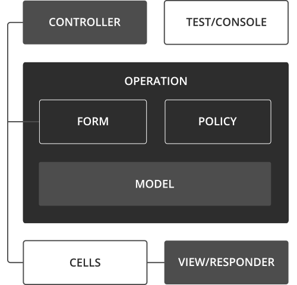

## About Trailblazer

Trailblazer gives you a high-level architecture for web applications.

Logic that used to get violently pressed into MVC is restructured and decoupled from the Rails framework. New abstraction layers like operations, form objects, authorization policies, data twins and view models guide you towards a better architecture.

By applying encapsulation and good OOP, Trailblazer maximizes reusability of components, gives you a more intuitive structure for growing applications and adds conventions and best practices on top of Rails' primitive MVC stack.

A polymorphic architecture sitting between controller and persistence is designed to handle many different contexts and helps to minimize code to handle various user roles and edge cases.

<!-- Controller -->

  <h3>Controller</h3>
  
Controllers in Trailblazer end up as lean HTTP endpoints: they instantly dispatch to an operation.

  
No business logic is allowed in controllers, only HTTP-related tasks like redirects.

  

    
class CommentsController < ApplicationController
  def new
    form Comment::Update
  end

  def create
    run Comment::Update do |op|
      return redirect_to comments_path(op.model)
    end

    render :new
  end
    
  

    
class Comment < ActiveRecord::Base
  has_many   :users
  belongs_to :thing

  scope :recent, -> { limit(10) }
end
    
  

<!-- Model -->

  <h3>Model</h3>
  
Models only contain associations, scopes and finders. Solely persistence logic is allowed.

  
That's right: No callbacks, no validations, no business logic in models. 

<!-- Operation -->

  <h3>Operation</h3>
  

    

      
Per public action, there's one operation orchestrating the business logic.

      
This is where your domain code sits: Validation, callbacks, authorization and application code go here.

      
Operations are the only place to write to persistence via models.

    

    <a href="/gems/operation">Learn more</a>
  

  

    
class Comment::Create < Trailblazer::Operation
  contract do
    property :body
    validates :body, length: {maximum: 160}
  end

  def process(params)
    if validate(params)

    else

    end
  end
end
    
  

  

    
contract do
  property :body
  validates :body, length: {maximum: 160}

  property :author do
    property :email
    validates :email, email: true
  end
end
    
  

<!-- Form -->

  <h3>Form</h3>
  
Every operation contains a form object. 

    
This is the place for validations.

  
Forms are plain Reform classes and allow all features you know from the popular form gem.

  
Forms can also be rendered using form builders like Formtastic or Simpleform.

<!-- Callback -->

  <h3>Callback</h3>
  
Callbacks are invoked from the operation, where you want them to be triggered.

  
They can be configured in a separate Callback class.

  
Callbacks are completely decoupled and have to be invoked manually, they won't run magically.

  

    
callback do
  on_create :notify_owner!

  property :author do
    on_add :reset_authorship!
  end
end
    
  

  

    
policy do
  user.admin? or not post.published?
end
    
  

<!-- Policy -->

  <h3>Policy</h3>
  
Policies allow authentication on a global or fine-granular level.

  
Again, this is a completely self-contained class without any coupling to the remaining tiers.

<!-- View Model -->

  <h3>View Model</h3>
  
Cells encapsulate parts of your UI in separate view model classes and introduce a widget architecture.

  
Views are logic-less. There can be deciders and loops. Any method called in the view is directly called on the cell instance.

  
Rails helpers can still be used but are limited to the cell's scope.

  

    
class Comment::Cell < Cell::ViewModel
  property :body
  property :author

  def show
    render
  end

private
  def author_link
    link_to "#{author.email}", author
  end
end

  

  

    

  <%= body %>
  By <%= author_link %>


  

  
<h1>Comments for <%= @thing.name %></h1>

This was created <%= @thing.created_at %>

  <%= concept("comment/cell",
  collection: @thing.comments) %>
    

<!-- View Model -->

  <h3>Views</h3>
  
Controller views are still ok to use.

  
However, replacing huge chunks with cells is encouraged and will simplify your views.

<!-- Representer -->

  <h3>Representer</h3>
  
Document APIs like JSON or XML are implemented with Representers which parse and render documents.

  
Representers are plain Roar classes. They can be automatically infered from the contract schema.

  
You can use media formats, hypermedia and all other Roar features.

  


representer do
  include Roar::JSON::HAL

  property :body
  property :user, embedded: true

  link(:self) { comment_path(model) }
end

  

  

  
class Comment::Update < Create
policy do
  is_owner?(model)
end
end
  
  

<!-- Inheritance -->

  <h3>Inheritance</h3>
  
Trailblazer reintroduces object-orientation.

  
For each public action, there's one operation class.

  
Operations inherit contract, policies, representers, etc. and can be fine-tuned for their use case.

<!-- Polymorphism -->

  <h3>Polymorphism</h3>
  
Operations, forms, policies, callbacks are all designed for a polymorphic environment.

  
Different roles, contexts or rules are handled with subclasses instead of messy <code>if</code>s.

  


class Comment::Create < Trailblazer::Operation
  build do |params|
    Admin if params[:current_user].admin?
  end

  class Admin < Create
    contract do
      remove_validations! :body
    end
  end

  

  <h3>File Layout</h3>
  

    In Trailblazer, files that belong to one group are called _concepts_. They sit in one directory as Trailblazer introduces and new, more intuitive and easier to navigate file structure.
  

  <pre>
  app
  ├── concepts
  │   ├── comment
  │   │   ├── crud.rb
  │   │   ├── cell.rb
  │   │   ├── views
  │   │   │   ├── show.haml
  │   │   │   ├── list.haml
  │   │   │   ├── comment.css.sass
  │   │   └── twin.rb
  │   │
  │   └── post
  │       └── crud.rb
  </pre>

