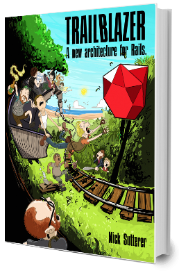

# Trailblazer

Trailblazer gives you a high-level architecture for web applications.

Logic that used to get violently pressed into MVC is restructured and decoupled from the Rails framework. New abstraction layers like operations, form objects, authorization policies, data twins and view models guide you towards a better architecture.

{: .left }

By applying encapsulation and good OOP, Trailblazer maximizes reusability of components, gives you a more intuitive structure for growing applications and adds conventions and best practices on top of Rails' primitive MVC stack.

Controllers and models end up as lean endpoints for HTTP dispatching and persistence. A polymorphic architecture sitting between controller and persistence is designed to handle many different contexts helps to minimize code to handle various user roles and edge cases.

  <h3>Controller</h3>

  

    

      
Controllers in Trailblazer end up as lean HTTP endpoints: they instantly dispatch to an operation.

      
No business logic is allowed in controllers, only HTTP-related tasks like redirects.

    

  

  

    
class CommentsController < ApplicationController
  def new
    form Comment::Update
  end

  def create
    run Comment::Update do |op|
      return redirect_to comments_path(op.model)
    end

    render :new
  end
    
  

    

    
class Comment < ActiveRecord::Base
  has_many   :users
  belongs_to :thing

  scope :recent -> { limit(10) }
end
    
  

  

    <h3>Model</h3>

    

      
Models only contain associations, scopes and finders. Solely persistence logic is allowed.

      
That's right: No callbacks, no validations, no business logic in models. 

    

  

  <h3>Operation</h3>

  

    

      
Operations contain business logic per action. This is where your domain code sits: Validation, callbacks and application code sits here.

      

    

  

  

    
class Comment::Create < Trailblazer::Operation
  contract do
    property :body
    validates :body, length: {maximum: 160}
  end

  def process(params)
    if validate(params)

    else

    end
  end
end
    
  

    

    
contract do
  property :body
  validates :body, length: {maximum: 160}

  property :author do
    property :email
    validates :email, email: true
  end
end
    
  

  

    <h3>Forms</h3>

    

      
Every operation contains a form object.

      
This is a plain Reform class and allows all features you know from the popular form gem.

      
Forms can also be rendered.

    

  

  <h3>Callback</h3>

  

    

      
Callbacks are invoked from the operation, where you want them to be triggered.

      
They can be configured in a separate Callback class.

      
Callbacks are completely decoupled and have to be invoked manually, they won't run magically.

    

  

  

    
callback do
  on_create :notify_owner!

  property :author do
    on_add :reset_authorship!
  end
end
    
  

  

    
policy do
  user.admin? or not post.published?
end
    
  

  

    <h3>Policy</h3>

    

      
Policies allow authentication on a global or fine-granular level.

      
Again, this is a completely self-contained class without any coupling to the remaining tiers.

    

  

<h3>View Model</h3>
<h3>Representer</h3>
<h3>Polymorphism</h3>

## File Layout

## Gems

Trailblazer is an architectural style. However, what sounds nice in theory is backed by gems for you to implement that style.

The gems itself are completely self-contained, minimalistic and solve just one particular problem. Many of them have been in use in thousands of production sites for years.

[a grid is what we need here]

## [Cells](/gems/cells)

  

    Cells provide view models to encapsulate parts of your views into classes. A view model is an object-oriented partial and doesn't know anything about the controller or the rendering view.
  

  

    
class Comment::Cell < Cell::ViewModel
  property :body
  property :author

  def show
    render
  end

private
  def author_link
    link_to "#{author.email}", author
  end
end
    
  

  

    Views can be Haml, ERB, or Slim. Method calls are the only way to retrieve data. Methods are directly called on the cell instance.
  

  

    
%h3 New Comment
  = body

By #{author_link}
    
  

## [Operation](gems/operation)

An operation is the central concept of Trailblazer. It contains all business logic for one use case in your application.

Operation acts as an orchestrating object that benefits from internal policies, form object, models and more.

Contract: central schema. infer representer (serialization and parsing docs). data structure. whitelist of what to process.

## [Reform](gems/reform)

## [Representable](gems/representable)

## Roar

## Twin

## The Book

Yes, there's a book! It is about 60% finished and will get another 150 pages, making it 300 pages full of wisdom about Trailblazer and all the gems.

If you want to learn about this project and if you feel like supporting Open-Source, please [buy it](https://leanpub.com/trailblazer).

